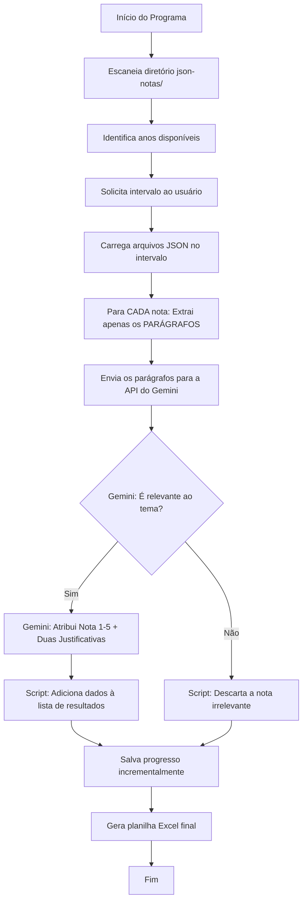

# Plano de Implementação - Analisador de Governança Global Digital MRE

Este plano descreve o desenvolvimento de uma aplicação em Python para analisar notas à imprensa do Ministério das Relações Exteriores (MRE) do Brasil, focando em Governança Global Digital.

## Visão Geral

A aplicação lê arquivos JSON que contêm as notas de imprensa do MRE estruturadas por ano e mês. Ela identifica os anos disponíveis, solicita um intervalo de análise ao usuário e usa a **API do Gemini** para analisar o contexto de cada nota dentro do intervalo. A API do Gemini faz a filtragem contextual e, **apenas se a nota for relevante**, faz a classificação de alinhamento político (atribuindo uma nota de 1 a 5) **utilizando única e exclusivamente o conteúdo dos parágrafos da nota**.

Ao final, o programa gera uma planilha Excel contendo os dados das notas relevantes.

## Onde a API do Gemini é usada?

A API do Gemini é chamada de dentro do próprio script Python. O script lê cada nota de imprensa dos arquivos JSON locais e envia apenas o texto dos parágrafos consolidados para a API do Gemini. A API analisa o texto e retorna um JSON estruturado indicando se a nota é relevante e, se sim, a nota atribuída e as justificativas.

## Tecnologias Utilizadas

- **Python 3.13+**
- **Google GenAI SDK (`google-genai`)**: Para chamadas estruturadas ao Gemini.
- **Modelo**: `gemini-flash-lite-latest` (selecionado por compatibilidade com a camada gratuita da API).
- **Pydantic**: Para definir o esquema de resposta estruturada do Gemini (Structured Outputs).
- **python-dotenv**: Para gerenciar a chave de API (`GEMINI_API_KEY`) via arquivo `.env`.
- **pandas** e **openpyxl**: Para salvar os resultados diretamente em formato Excel (`.xlsx`).
- **tqdm**: Para exibir uma barra de progresso visual durante a análise.

## Temas Filtrados pela IA

A IA avalia se cada nota aborda **diretamente** um dos seguintes temas:
- Governança Global Digital
- Governança da Inteligência Artificial
- Governança da Internet
- Governança de Dados

Notas que apenas mencionam tecnologia de passagem, calendários de eventos ou temas genéricos de cooperação internacional são descartadas como irrelevantes.

## Escala de Classificação (1 a 5)

| Nota | Descrição | Características |
|------|-----------|-----------------|
| 1 | Soberania Digital | Soberania digital do Estado, garantias democráticas, direitos fundamentais, multilateralismo, multissetorialismo |
| 2 | Predominantemente Soberanista | Foco principal na soberania e direitos, com alguma abertura para inovação |
| 3 | Modelo Misto | Equilíbrio entre soberania/direitos e desenvolvimento/inovação (não puramente mercantil) |
| 4 | Predominantemente Liberal | Foco principal na inovação e abertura de mercado, com alguma regulação estatal |
| 5 | Baixa Intervenção Estatal | Inovação livre, autorregulação, lógica mercantil |

## Fluxo do Sistema



## Estrutura de Resposta da IA (Structured Outputs - Pydantic)

```python
class AnaliseNota(BaseModel):
    relevante: bool              # A nota é relevante aos temas de governança?
    justificativa_relevancia: str # Por que a nota é (ou não) relevante
    nota: Optional[int]          # Nota de 1 a 5 (null se irrelevante)
    justificativa_nota: Optional[str]  # Trechos/citações do texto que justificam a nota
```

## Estrutura da Planilha Excel de Resultados

A planilha (`relatorio_governanca_digital.xlsx`) contém as seguintes colunas, nesta ordem:

| Coluna | Descrição |
|--------|-----------|
| **Ano** | Ano extraído da data da nota (para facilitar análise temporal) |
| **Data** | Data completa de publicação da nota à imprensa |
| **Título** | Título da nota à imprensa |
| **Link** | Link de acesso original |
| **Parágrafos** | Texto consolidado dos parágrafos (usado na análise) |
| **Nota Atribuída** | Valor de 1 a 5 atribuído pelo Gemini |
| **Justificativa da Relevância** | Explicação do Gemini sobre por que a nota se enquadra nos temas de governança |
| **Justificativa da Nota (Evidências)** | Passagens e trechos literais do texto que comprovam e fundamentam a pontuação escolhida |

## Tratamento das Limitações da API (Resiliência)

Durante o desenvolvimento, enfrentamos limitações severas da camada gratuita do Google. As seguintes estratégias foram implementadas:

### Seleção de Modelo
Foram testados e descartados vários modelos por incompatibilidade com a cota gratuita:
- ~~`gemini-2.5-flash`~~ → Cota de apenas ~20 requisições/dia
- ~~`gemini-1.5-flash`~~ → Indisponível no novo SDK (Erro 404)
- ~~`gemini-2.0-flash`~~ → Cota zero para contas recentes (Erro 429)
- ~~`gemini-2.5-flash-lite`~~ → Restrito a contas pagas (Erro 404)
- ✅ **`gemini-flash-lite-latest`** → Cota gratuita funcional

### Tolerância a Falhas
- **Erro 429 (Rate Limit)**: Pausa de 65 segundos + retry automático (até 6 tentativas).
- **Erro 503 (Servidor Congestionado)**: Tratado com a mesma lógica do 429, permitindo que o script espere e retome sem abortar.
- **Backoff exponencial** para outros erros transitórios.

### Persistência Incremental
- Progresso salvo em tempo real no arquivo `progresso_analise.json`.
- Cada nota processada é registrada por um ID único (`link|data|titulo`).
- Em caso de interrupção, o script retoma exatamente de onde parou sem reprocessar notas anteriores.

## Plano de Verificação

### Testes Manuais
1. Executar o script `analisador.py`.
2. Verificar a exibição dos anos disponíveis no terminal.
3. Informar um intervalo curto para teste (ex: 2026-2026).
4. Acompanhar a barra de progresso e as chamadas ao Gemini.
5. Inspecionar o arquivo `relatorio_governanca_digital.xlsx` e confirmar:
   - Presença da coluna **Ano** (além da coluna Data).
   - Separação entre **Justificativa da Relevância** e **Justificativa da Nota (Evidências)**.
   - Que notas irrelevantes foram descartadas.
   - Que as evidências citam trechos reais do texto original.
